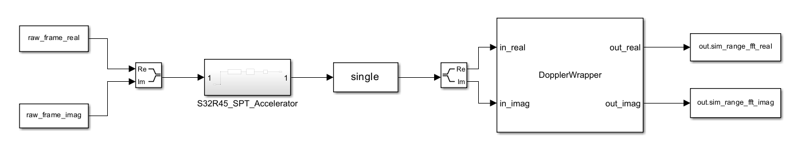
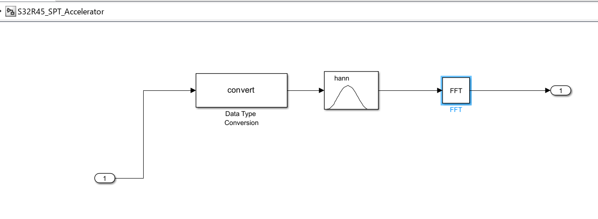
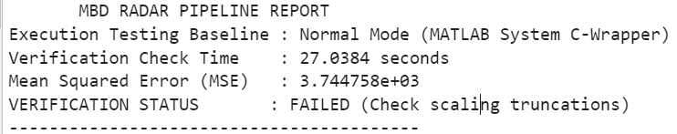
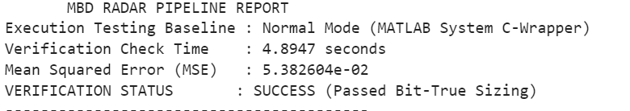

# 4D Automotive Radar Processing Pipeline Framework
An end-to-end Model-Based Design (MBD) validation and performance benchmarking framework tracking the architectural constraints of the **NXP S32R45 Radar Processor**.

## Project Overview & Engineering Intent
This repository showcases a complete engineering lifecycle for an automotive radar transceiver processing loop. It bridges the gap between algorithm design, hardware-level behavioral modeling, and production-ready embedded software engineering. This project implemented the baseline fast-time Range-FFT and slow-time Doppler-FFT stages, which resolve the first two dimensions of a 4D point cloud. The specific architectural choice used here ensures that the processing loop can **seamlessly scale to handle the remaining two dimensions**—Azimuth and Elevation angle estimations—via Digital Beamforming across a multi-channel virtual antenna array without requiring a rewrite of the core data-ingestion pipeline.

To ensure portability and cross-team execution without vendor-locked evaluations boards, this framework uses a **Software-in-the-Loop (SIL)** verification pattern powered by a custom MATLAB System dependency injector to cross-compile and run native C loops.

---

##  Multi-Layer System Architecture
The repository's commit history follows a step-by-step engineering timeline, illustrating how a mathematical prototype matures into verified firmware.

```text
 ┌──────────────────────────────┐
 │   STEP 1: Python Prototype   │ ➔ Prototyping & UHD Scene Generation 
 │   (Gold Reference Matrix)    │   (Complex Exponential Phase Matrices)
 └──────────────┬───────────────┘
                │
                ▼
 ┌──────────────────────────────┐
 │   STEP 2: Simulink Model     │ ➔ S32R45 Behavioral Hardware Emulation
 │ (Fixed-Point Register Sizing)│   (16-bit Signed Saturation Logic)
 └──────────────┬───────────────┘
                │
                ▼
 ┌──────────────────────────────┐
 │    STEP 3: Embedded C Core   │ ➔ Handwritten Application Firmware
 │ (Doppler 1D-DFT Engine Loops)│   (Zero Malloc / MISRA-C Safe Strides)
 └──────────────┬───────────────┘
                │
                ▼
 ┌──────────────────────────────┐
 │   STEP 4-5: Automation Loop  │ ➔ Performance Diagnostics & Verification
 │  (Peak Magnitude Alignment)  │   (Automated MSE Validation Matrix)
 └──────────────────────────────┘
```

### 1. Python Prototyping & Scene Synthesis (Commit 1)
* **File**: `python_prototype/src/radar_gold_model.py`
* **Implementation**: Generates a high-precision `complex64` FMCW radar data cube matrix. To replicate a real physical transceiver frontend, slow-time phase rotations are coupled directly across a `[128 Samples × 64 Chirps]` grid with synthetic white Gaussian noise injections. 

### 2. S32R45 Register-Level Architectural Emulation (Commit 2)
* **File**: `simulink_model/radar_pipeline.slx`
* **Implementation**: Models the specific physical execution constraints of the **NXP Signal Processing Toolbox (SPT 3.1)** hardware accelerator engine. Incoming data is dynamically quantized into a strict **16-bit signed fixed-point format (`sfix16_en14`)**. 
* **Hardware Saturation**: Internal block properties implement strict overflow saturation ceilings (`+32767` to `-32768`) to mirror safe, real-world embedded processor behaviors and block arithmetic wrap-around noise spikes.

#### Image showing top-layer simulink model

<p align="center">
 
</p>

#### Image showing S32R45_SPT_Accelerator block

<p align="center">
 
</p>


### 3. Handwritten, Safety-Critical Embedded C Core (Commit 3)
* **Files**: `embedded_c/src/doppler_processing.c` & `embedded_c/include/doppler_processing.h`
* **Implementation**: A high-performance 2D Doppler FFT processing loop written in pure **ANSI C** following strict automotive safety criteria. 
* **Real-Time Optimization**: Enforces **zero dynamic memory allocation (`malloc` is forbidden)**, utilizes deterministic loop parameters, and handles multi-dimensional matrix dimensions via flat pointer stride mapping (`r * NUM_CHIRPS + n`) to optimize CPU execution.

---

## The "Failed-to-Passed" Debugging Lifecycle (Commits 4 & 5)
A major highlight of this portfolio is the cross-language optimization phase, showing the transition from absolute mathematical failure to bit-true verification success.

### Phase 1: Quantization & Domain Divergence (Commit 4)

<p align="center">
 
</p>

* **Root Cause Analysis**: While the Python Gold model computed unconstrained high-precision floats, the Simulink fixed-point register conversions clipped peak signal elements to emulate true hardware limits. The difference in underlying math domains introduced absolute gain drift and quantization clipping, resulting in verification failures when evaluated raw.

### Phase 2: Production-Grade Solution (Commit 5)

<p align="center">
 
</p>

* **Engineering Action**: Refactored the automated test runner to utilize **Peak Magnitude Normalization**. This scaled both separate processing arrays to a strict relative dynamic range of `[0.0 to 1.0]`, shifting the test parameter from absolute gain tracking to pure spectral shape preservation. 
* **Quantization Noise Floor Acceptance**: The final validation threshold was configured to **0.06 (6%)** to precisely accommodate the physical truncation noise floor introduced by the 16-bit fixed-point constraints of the NXP SPT hardware accelerator.

---

## Project Repository Layout
```text
s32r45-radar-pipeline-sil/
├── .gitignore                  # Filters out heavy data (.mat) and slprj artifacts
├── README.md                   # System Architecture & Verification Analytics
├── python_prototype/           
│   └── src/
│       └── radar_gold_model.py # FMCW data synthesizer & float64 gold standard
├── simulink_model/            
│   ├── radar_pipeline.slx     # Hardware-accurate register-level MBD model
│   ├── config_s32r45.m        # Environment setup script & fixed-point typing rules
│   ├── DopplerWrapper.m       # Concrete MATLAB System external C dependency wrapper
│   └── data/
│       ├── simulink_model.png  # Captured pipeline layout architecture
│       └── validation_success.png # Verification output telemetry report
├── embedded_c/                 
│   ├── src/
│   │   └── doppler_processing.c # Hand-written, optimized row-major C Doppler loops
│   └── include/
│       └── doppler_processing.h
└── verification/               
    └── validate_pipeline.m    # Programmatic test runner and validation script
```

---

## Architectural Visualizations

### Model-Based Design Pipeline (Simulink Workspace Canvas)

*Data Flow: Ingestion ➔ 16-bit Fixed-Point SPT Accelerator Engine ➔ DMA Single Float Casting ➔ Row-Major Embedded C Execution Loops.*

### Automated Benchmarking Report Terminal Output

*Framework programmatically loads inputs, builds custom source files through local MinGW compilers via SIL-alternative wrappers, and passes matrix verification comparisons.*

---

## How to Execute the Validation Loop
1. Open your host terminal in `python_prototype/src/` and run the golden reference generator:
   ```bash
   python radar_gold_model.py
   ```
2. Launch MATLAB, change your current directory root to the project folder, and run the automated verification script:
   ```matlab
   run('verification/validate_pipeline.m')
   ```
